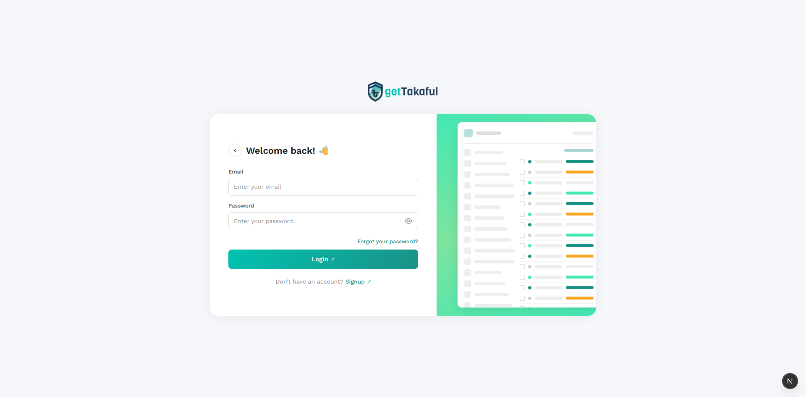
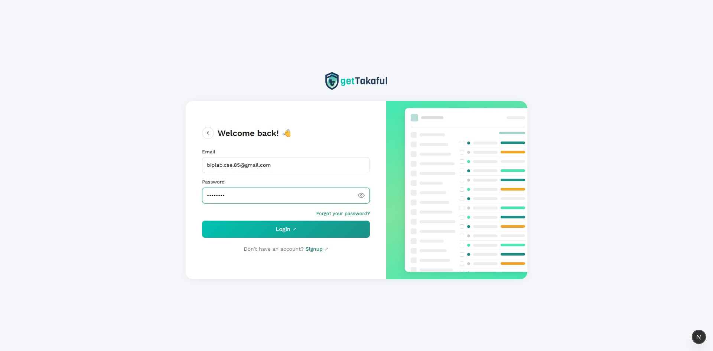
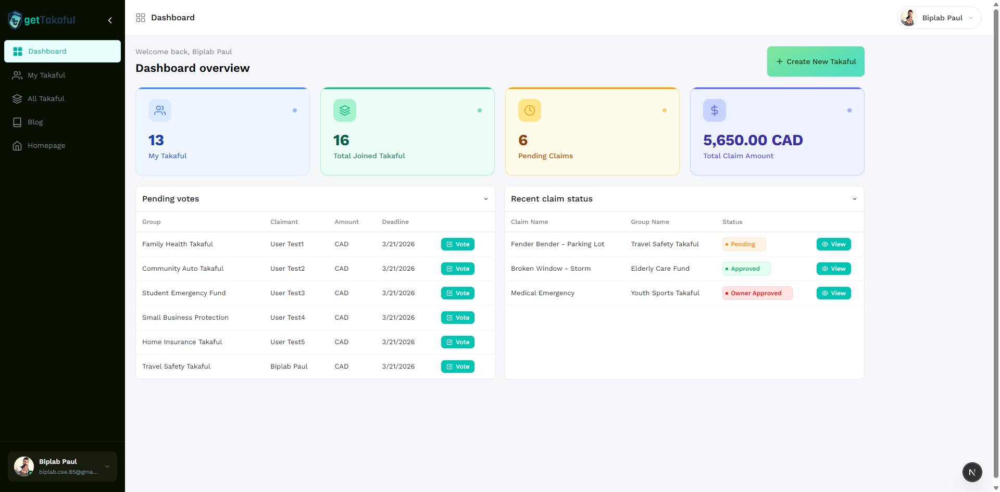
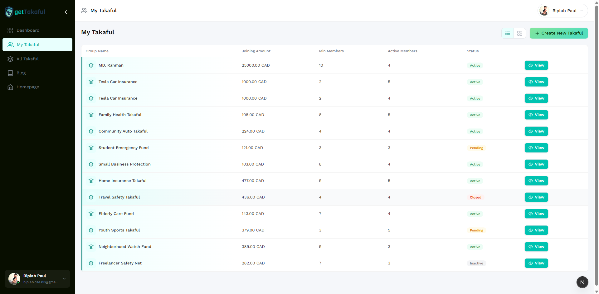
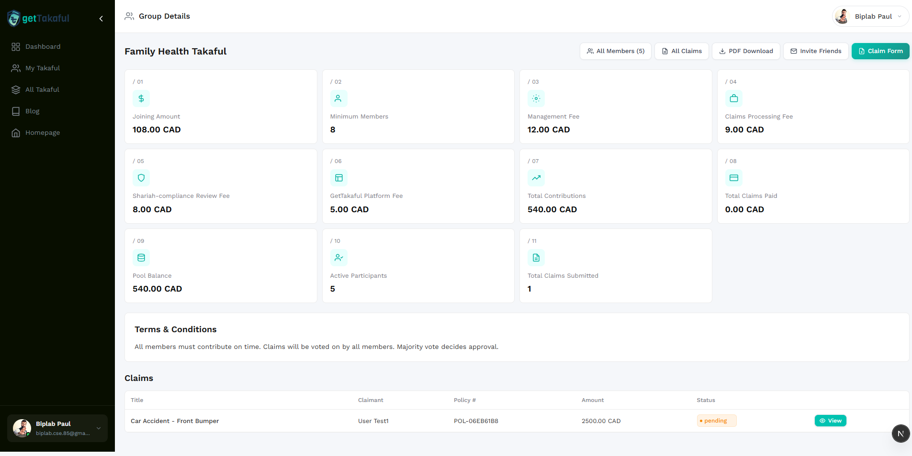
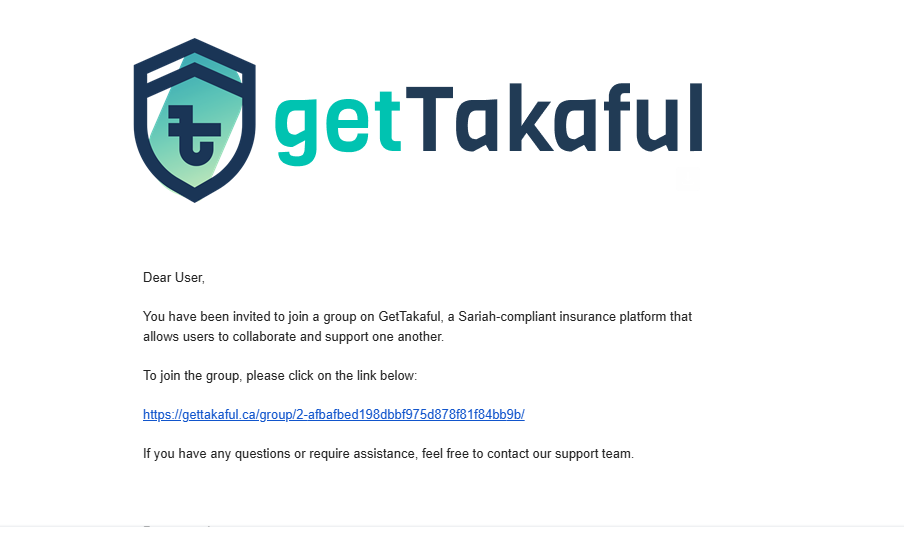
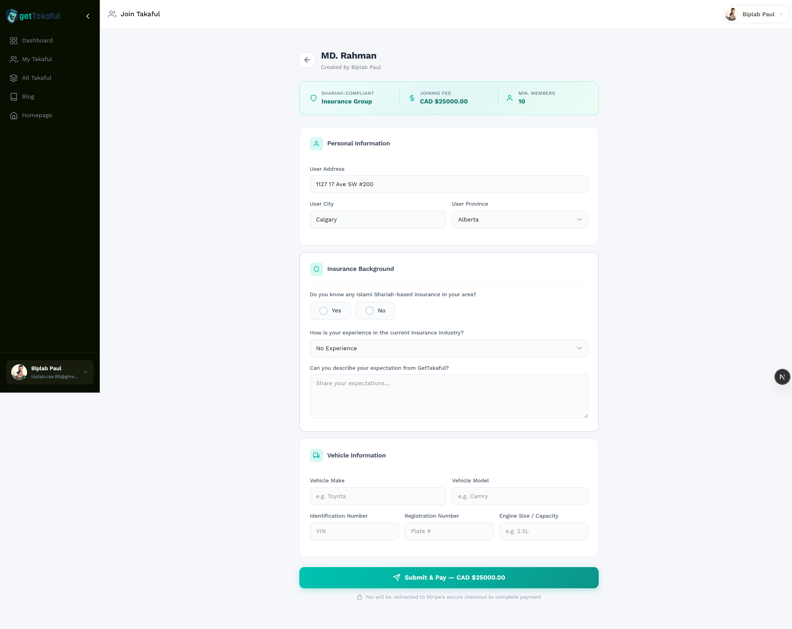
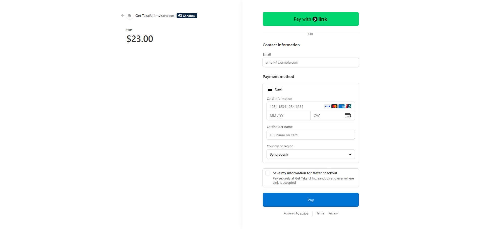
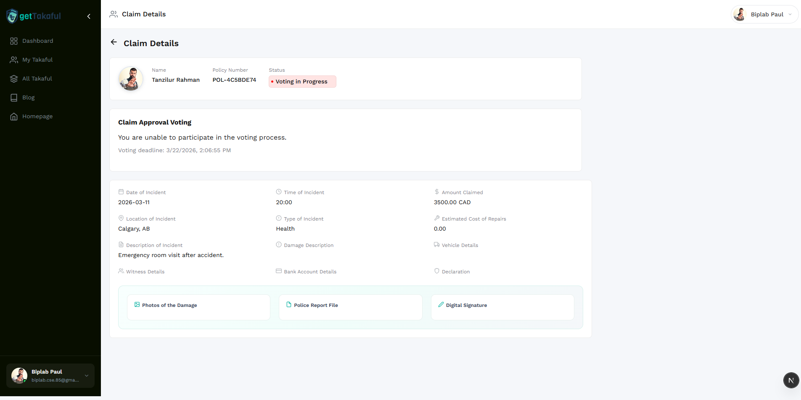
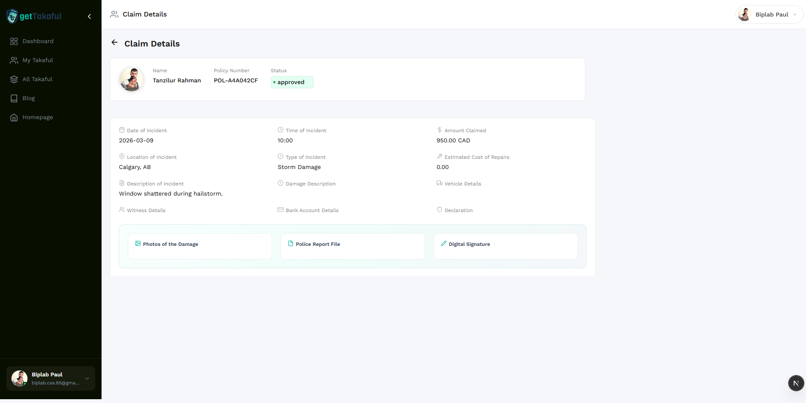

# GetTakaful - User Guide

## Table of Contents

1. [Introduction](#1-introduction)
2. [User Authentication](#2-user-authentication)
3. [Dashboard Overview](#3-dashboard-overview)
4. [Group Management](#4-group-management)
5. [Invitation and Joining Process](#5-invitation-and-joining-process)
6. [Payment Process](#6-payment-process)
7. [Navigation and Routing](#7-navigation-and-routing)
8. [Claims System](#8-claims-system)
9. [Claim Approval Workflow](#9-claim-approval-workflow)
10. [Voting System](#10-voting-system)
11. [Email Notifications](#11-email-notifications)
12. [Conclusion](#12-conclusion)

---

## 1. Introduction

GetTakaful is a Shariah-compliant cooperative insurance platform that enables communities to collaboratively manage risk. Members form groups, pool their contributions, and collectively decide on claim payouts through a transparent voting system.

**Key Features:**
- Create and manage Takaful (cooperative insurance) groups
- Invite members via email with branded invitation templates
- Secure payment processing through Stripe
- Submit insurance claims with supporting documentation
- Owner-reviewed claim approval workflow
- Democratic voting system with a 70% approval threshold
- Real-time voting results with visual charts
- Email notifications at every step of the workflow

---

## 2. User Authentication

### 2.1 Registration (Sign Up)

To create a new account on GetTakaful:

1. Navigate to the **Sign Up** page by clicking "Signup" on the login screen.
2. Fill in the required fields:
   - **First Name** and **Last Name**
   - **Email Address** (must be unique)
   - **Phone Number** (optional)
   - **Password** (minimum 8 characters)
3. You will receive an OTP (One-Time Password) via email to verify your account.
4. Enter the OTP to complete registration.

### 2.2 Login

1. Open the application and you will see the Login page.
2. Enter your **Email** and **Password**.
3. Click the **Login** button.


*Figure 2.1: The GetTakaful login page with email and password fields.*


*Figure 2.2: Login form filled with user credentials ready to submit.*

### 2.3 Forgot Password

If you forget your password:
1. Click **"Forgot your password?"** on the login page.
2. Enter your registered email address.
3. You will receive a password reset email with instructions.

### 2.4 Logout

To log out, click your **profile name** in the top-right corner or the bottom-left of the sidebar, then select **Logout**.

---

## 3. Dashboard Overview

After logging in, you are taken to the Dashboard, which provides a complete overview of your activity on the platform.


*Figure 3.1: The main dashboard showing key statistics, pending votes, and recent claims.*

### 3.1 Statistics Cards

The top section displays four key metrics:

| Card | Description |
|------|-------------|
| **My Takaful** | Number of groups you have created |
| **Total Joined Takaful** | Total groups you are a member of |
| **Pending Claims** | Claims awaiting your action or review |
| **Total Claim Amount** | Sum of all claim amounts in your groups |

### 3.2 Pending Votes

The **Pending Votes** table shows claims that require your vote. Each row displays:
- **Group** name
- **Claimant** name
- **Amount** claimed
- **Deadline** for voting
- **Vote** button to cast your decision

### 3.3 Recent Claim Status

The **Recent Claim Status** table shows claims you have submitted, with:
- **Claim Name**
- **Group Name**
- **Status** (Pending, Owner Approved, Approved, Rejected)
- **View** button to see claim details

---

## 4. Group Management

### 4.1 Viewing Your Groups

Navigate to **My Takaful** from the sidebar to see all groups you have created.


*Figure 4.1: List of all Takaful groups created by the user.*

Each group shows:
- **Group Name**
- **Joining Amount** (in CAD)
- **Minimum Members** required
- **Active Members** count
- **Status** (Active, Pending, Closed, Inactive)

### 4.2 Creating a New Group

1. Click the **"+ Create New Takaful"** button (available on the Dashboard or My Takaful page).
2. Fill in the group details:
   - **Takaful Name** (required) - e.g., "Calgary Community Auto Takaful"
   - **Description** - Brief explanation of the group's purpose
   - **Joining Amount (CAD)** (required) - The fee each member pays to join
   - **Minimum Members** (required) - Minimum number of members needed
   - **Management Fee** - Administrative fee per member
   - **Claims Processing Fee** - Fee for processing each claim
   - **Shariah Review Fee** - Fee for Shariah compliance review
   - **Platform Fee** - GetTakaful platform usage fee
   - **Terms & Conditions** - Rules governing the group
3. Click **"Create Takaful"** to create the group.

You are automatically added as the **Admin** of the group.

### 4.3 Group Detail Page

Click **"View"** on any group to see its full details.


*Figure 4.2: Group detail page showing fees, statistics, terms, and claims.*

The group detail page displays:
- **Fee Cards** (01-06): Joining amount, minimum members, management fee, claims processing fee, Shariah review fee, and platform fee.
- **Statistics Cards** (07-11): Total contributions, claims paid, pool balance, active participants, and total claims submitted (visible to members only).
- **Terms & Conditions**: Group rules set by the creator.
- **Claims Table**: List of all claims submitted in the group.

### 4.4 Action Buttons

At the top-right of the group detail page:
- **All Members (X)** - View all group members with their vehicle details
- **All Claims** - View all claims in the group
- **PDF Download** - Download the group details as a PDF
- **Invite Friends** - Open the invitation panel to invite new members
- **Claim Form** - Submit a new insurance claim

---

## 5. Invitation and Joining Process

### 5.1 Inviting Members

1. Open a group detail page.
2. Click the **"Invite Friends"** button.
3. A slide panel will open on the right side.
4. Enter one or more email addresses (separated by commas or new lines).
5. Click **"Send Invitations"**.

Each invited person will receive a branded email with a link to join the group.


*Figure 5.1: The invitation email received by the invited user with a join link.*

### 5.2 Joining a Group

When an invited user clicks the link in the email, they are taken to the **Join Group** page.


*Figure 5.2: The join form with personal information, insurance background, and vehicle details.*

The join form has three sections:

**Personal Information:**
- User Address
- User City
- User Province (dropdown with all Canadian provinces)

**Insurance Background:**
- "Do you know any Islami Shariah-based insurance in your area?" (Yes/No)
- Insurance experience level (dropdown)
- Expectations from GetTakaful (text area)

**Vehicle Information:**
- Vehicle Make (e.g., Honda)
- Vehicle Model (e.g., Civic)
- Identification Number (VIN)
- Registration Number (Plate #)
- Engine Size/Capacity (e.g., 2.0L)

After filling the form, click **"Submit & Pay"** to proceed to payment.

---

## 6. Payment Process

### 6.1 Stripe Checkout

When you click **"Submit & Pay"**, you are redirected to **Stripe's secure checkout page**.


*Figure 6.1: Stripe checkout page showing the group name, amount, and payment form.*

The checkout page displays:
- **Group name** and **joining fee amount**
- **Email** (pre-filled with your account email)
- **Card information** fields
- **Cardholder name**
- **Country or region**

**For testing**, use the Stripe test card: `4242 4242 4242 4242` with any future expiry date and any CVC.

### 6.2 Payment Confirmation

After successful payment:
1. You are redirected to a **success page** that verifies your payment.
2. Your profile and vehicle data are saved.
3. You are automatically added as a **member** of the group.
4. You are redirected to the **group dashboard**.

If payment fails or is cancelled, you can return to the join form and try again.

---

## 7. Navigation and Routing

### 7.1 Main Navigation (Sidebar)

The left sidebar provides access to all main sections:

| Menu Item | Route | Description |
|-----------|-------|-------------|
| **Dashboard** | `/dashboard` | Main overview with statistics and activity |
| **My Takaful** | `/my-takaful` | Groups you have created |
| **All Takaful** | `/my-joined-takaful` | Groups you have joined |
| **Blog** | External link | GetTakaful blog |
| **Homepage** | External link | GetTakaful website |

### 7.2 Key Application Routes

| Route | Description |
|-------|-------------|
| `/login` | User login page |
| `/signup` | New user registration |
| `/forgot-password` | Password recovery |
| `/dashboard` | Main dashboard |
| `/my-takaful` | Your created groups |
| `/my-joined-takaful` | Your joined groups |
| `/groups/{id}` | Group detail page |
| `/join/{token}` | Join a group via invitation link |
| `/join/{token}/success` | Payment success confirmation |
| `/claims/{id}` | Claim detail and voting page |

---

## 8. Claims System

### 8.1 Submitting a Claim

To submit a claim, you must be a **member** of the group.

1. Open the group detail page.
2. Click the **"Claim Form"** button.
3. A modal window opens with the Insurance Claim Form.

**Required Fields:**
- **Date of Incident** - When the incident occurred
- **Amount Claimed** - The amount you are claiming (in CAD)
- **Photos of the Damage** (required) - Upload an image showing the damage
- **Police Report File** (required) - Upload a PDF or image of the police report
- **Digital Signature** (required) - Upload your digital signature image

**Optional Fields:**
- Time of Incident
- Location of Incident (e.g., "Calgary, AB")
- Type of Incident (e.g., "Collision", "Theft", "Storm Damage")
- Estimated Cost of Repairs
- Description of Incident
- Damage Description
- Vehicle Details
- Witness Details
- Bank Account Details
- Declaration

4. Click **"Submit"** to file the claim.

After submission:
- The claim status is set to **"Pending"** (awaiting owner review).
- An **email notification** is sent to the group owner with a link to review the claim.

### 8.2 Viewing Claim Details

Click **"View"** on any claim to see its full details.


*Figure 8.1: Claim detail page showing claimant info, voting section, incident details, and evidence documents.*

The claim detail page shows:
- **Claimant Information**: Name, policy number, and current status
- **Voting Section**: Voting form or results (depending on status)
- **Incident Details**: All submitted information organized in a grid layout with icons
- **Evidence Documents**: Photos, police report, and digital signature in styled cards

---

## 9. Claim Approval Workflow

The claim approval process follows a structured workflow:

```
Claim Submitted --> Owner Review --> Approved: Voting Begins
                                 --> Rejected: Claim Closed (with reason)

Voting Period (7 days) --> 70% Approved: Claim Approved
                       --> Less than 70%: Claim Not Approved
```

### 9.1 Step 1: Owner Review

When a claim is submitted, the group owner receives an email notification.

1. The owner clicks the **review link** in the email or navigates to the claim detail page.
2. The **Owner Review** section appears at the top of the page.
3. The owner can:
   - **Approve for Voting** - The claim moves to the voting phase, and all group members receive voting emails.
   - **Reject** - The owner must provide a **reason for rejection**. The claim status changes to "Rejected".

### 9.2 Step 2: Voting Phase

After the owner approves a claim:
- The claim status changes to **"Owner Approved"** (displayed as "Voting in Progress").
- All group members (except the claimant) receive an **email notification** with a "Vote Now" link.
- A **7-day voting window** begins.

### 9.3 Claim Statuses

| Status | Description |
|--------|-------------|
| **Pending** | Claim submitted, waiting for owner review |
| **Owner Approved** | Owner approved; voting is in progress |
| **Approved** | 70% of eligible voters approved the claim |
| **Rejected** | Owner rejected the claim with a reason |

---

## 10. Voting System

### 10.1 How to Vote

1. Navigate to the claim detail page (via the email link or the dashboard).
2. In the **Claim Approval Voting** section, select your decision:
   - **Approve** - You support the claim
   - **Deny** - You oppose the claim
3. Optionally add a **comment** explaining your decision.
4. Click **"Submit Vote"**.

### 10.2 Voting Rules

- Every group member (except the claimant) can participate in voting.
- **One user = one vote**. You cannot change your vote after submitting.
- The claimant **cannot vote** on their own claim.
- Voting is open for **7 days** after the owner approves the claim.
- After the deadline, no more votes can be cast.

### 10.3 Approval Threshold

A claim is **approved only if at least 70% of eligible voters** vote in favor.

**Example:**
- Group has 10 members
- 1 member is the claimant (cannot vote)
- 9 eligible voters
- At least 7 members (70% of 9 = 6.3, rounded up) must vote "Approve"

### 10.4 Viewing Voting Results

Any user visiting the claim detail page can see the **Voting Result** section, which includes:


*Figure 10.1: Claim detail page showing the approved status and incident details.*

The voting result section displays:

**Donut Chart:**
- Visual breakdown of Approved (teal), Denied (red), and Not Voted (gray)
- Center label showing the overall approval percentage

**Statistics Panel:**
- Approved votes count and percentage
- Denied votes count and percentage
- Not voted count and percentage
- Total participants out of eligible voters

**Threshold Progress Bar:**
- Visual bar showing current approval percentage
- Marker at the 70% threshold
- Badge indicating "Threshold Met", "Threshold Not Met", or "Claim Approved"

---

## 11. Email Notifications

GetTakaful sends automated email notifications at key points in the workflow:

### 11.1 Group Invitation Email

**Trigger:** When a group member invites someone via the "Invite Friends" panel.

**Content:**
- GetTakaful logo
- Greeting message
- Description of the platform
- A clickable link to join the group


*Figure 11.1: The branded invitation email with the join link.*

### 11.2 Claim Submitted Email (to Owner)

**Trigger:** When a group member submits a new claim.

**Recipient:** Group owner only.

**Content:**
- Claimant name
- Amount claimed
- Date of incident
- Policy number
- "Review Claim" button linking to the claim detail page

### 11.3 Voting Notification Email (to Members)

**Trigger:** When the group owner approves a claim for voting.

**Recipients:** All group members except the claimant.

**Content:**
- Group name
- Claimant name
- Amount claimed
- Voting deadline
- "Vote Now" button linking to the claim voting page

---

## 12. Conclusion

GetTakaful provides a complete, end-to-end Shariah-compliant cooperative insurance workflow:

1. **Create** a Takaful group with customized fees and terms.
2. **Invite** members via email with branded invitation templates.
3. **Join** through a secure form with personal, insurance, and vehicle information.
4. **Pay** the joining fee securely through Stripe checkout.
5. **Submit** insurance claims with required evidence (photos, police report, digital signature).
6. **Review** claims as a group owner (approve for voting or reject with reason).
7. **Vote** on claims democratically with a transparent 70% approval threshold.
8. **View** voting results with visual charts and detailed statistics.

The platform ensures transparency, fairness, and Shariah compliance at every step, empowering communities to support each other through cooperative insurance.

---

*This guide covers the GetTakaful platform as of March 2026. For questions or support, please contact the GetTakaful support team.*
